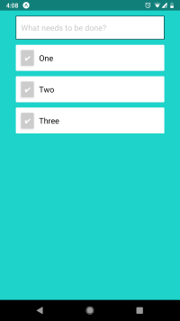

TODOs App
=========

Example mobile TODO app.

See the [API repo](https://github.com/joeyespo/todos-api) for the server component of this app.

<p align="center">
  
</p>

Setup
-----

```console
$ npm install
```


Run
---

#### Using [the public API](https://joeyespo-todos.herokuapp.com/)

```console
$ npm start
```

#### Running the full stack locally

1. Follow [the API](https://github.com/joeyespo/todos-api) setup steps,
   then run it on `0.0.0.0` to allow external clients to connect to it:

   ```console
   $ python manage.py runserver 0.0.0.0:8000
   ```

2. Add your local machine's IP address to a new `.env` file, for example:

   ```
   API_URL=http://192.168.1.1:8000/
   ```

3. Run

   ```console
   $ npm start
   ```
